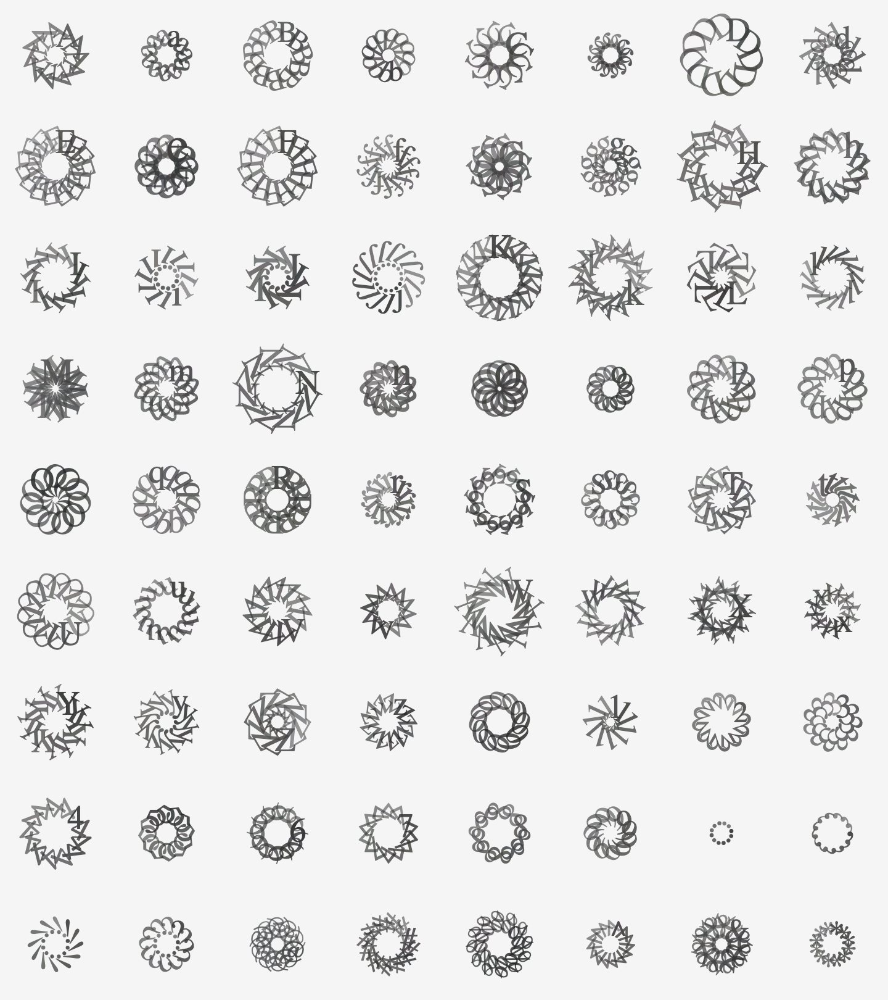

# cyberflowers

Every word is a seed of an idea. And seeds of thoughts with distinct emotion, arousal, attitude, and meaning would grow into different flowers of affects (n. emotion or desire, especially as influencing behavior or action). I built this Chrome extension with my Cyberflowers text-based art to help people find positive or negative sentiments on the web (for fun), with the help of ml5.js sentiment library. Please read my [documentation](https://blog.jpl.design/posts/s20/pixel-by-pixel/cyberflowers/) for more about this project.

The project was developed for **The World: Pixel by Pixel** course (NYU ITP, Spring 2020) under instructions of Daniel Rozin, during the quarantine in COVID-19 pandemic.

## How to use it?

0. Install Google Chrome.
1. Download this repository.
2. Go to `chrome://extensions` in your browser.
3. Turn on *Developer mode*.
4. Choose *Load unpacked* and load the folder.
5. Now you should see a cyberflower icon next to the address bar. You can go to any website with some text in it, click on the icon and the extension will start running.
6. You can either click on the character and sow a new cyberflower rooted on it, or select a section of text and move your cursor over it to quickly sow many. After that, you could also click on "Pick Cyberflowers" to save the picture of the flowers.

Please notice that although the extension requires `tabs` and `activeTab` permissions (there will be no pop-ups as everything happens in the background), the extension just uses them for the id of each tab and finding the active one.

## Technical References

1. [Determine the position index of a character within an HTML element when clicked - Stack Overflow](https://stackoverflow.com/questions/8105824/determine-the-position-index-of-a-character-within-an-html-element-when-clicked)
2. [Get Position of text inside a HTML element - Stack Overflow](https://stackoverflow.com/questions/30061542/get-position-of-text-inside-a-html-element)
3. [Sentiment - ml5.js](https://learn.ml5js.org/docs/#/reference/sentiment)
4. [Getting Started Tutorial - Chrome Extension](https://developer.chrome.com/extensions/getstarted)

## Links

1. [GitHub Repository](https://github.com/peilingjiang/ima-courses/tree/master/s20-pixel/final_cyberflowers) for the example p5.js sketches
2. [Embedded p5.js sketch](https://editor.p5js.org/peilingjiang/present/b6SH4VwL1) (Matrix)
3. [Embedded p5.js sketch](https://editor.p5js.org/peilingjiang/present/ixM4XnkKR) (Formation)
4. [Embedded p5.js sketch](https://editor.p5js.org/peilingjiang/present/hFP05DMUk) (Composition)
5. [Embedded p5.js sketch](https://editor.p5js.org/peilingjiang/present/-CYsUUWxC) (Groups)
